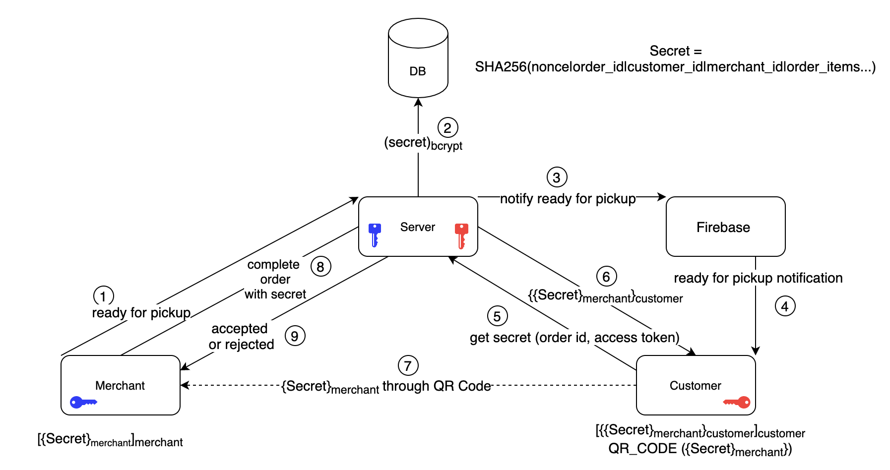

# JILY: Enhancement of Food Delivery Applications using Asymmetric Encryption

During the COVID-19 pandemic, more and more people have been relying on food delivery services as a means of ordering food without actually going out. As a 
result, however, the number of food thefts has also increased. Food delivery apps currently lack a form of authentication during the food transaction process, 
and thus, the food delivery process is vulnerable to adversaries seeking free food. Multiple cases involve drivers stealing orders and customers abusing the 
leniency of customer support. JILY is then a food pickup authentication protocol that aims to provide a quick and effortless way to verify the two parties 
within the order transaction. The prototype includes a backend server and an Android app, and showcases a standard food delivery app with the JILY protocol 
used during the food ordering process. The following discussion acts as a brief overview of the project.

## System Design
Existing food delivery and pickup systems lack authentication of order recipient under three scenarios:

1. Verifying the customer who picks up the food package associated with their order from a merchant.
2. Verifying the delivery person assigned to pick up an order from a merchant and deliver it to the right customer.
3. Verifying the customer who receives the order from the delivery person.

In each circumstance, the entity in possession of the order must verify the recipient before transferring the order. Thus, a design to address the lack of 
authentication in one scenario can easily be adapted to address the same issue in the other scenarios, thereby narrowing down the problem.

The JILY protocol is designed with the intention to make the order pickup process quick, simple, and secure for the customer and the merchants. The protocol 
follows the following sequence, based on the diagram outlined below:

<ol start="0">
  <li>When any user of the system logs in, the user's mobile application creates a set of fresh asymmetric keys and sends the public key to the server. 
Any secure asymmetric cryptography algorithm could be used.</li>
  <li>The JILY protocol begins when the merchant makes a call to the server to mark the order as ready for pickup.</li>
  <li>The server creates a <code>SHA-256</code> hash secret using the details of the order and a unique nonce. The secret is then encrypted and stored in 
the database in an entry corresponding to the order's ID.</li>
  <li>The server then makes a request to Google's Firebase with the customer's Firebase details.</li>
  <li>Firebase sends a notification to the customer's device with the status that the order is ready for pickup.</li>
  <li>Upon receiving the notification, the customer's device makes a request to the server seeking the order secret.</li>
  <li>The server responds with the order secret that has been encrypted twice using the following keys respectively: the customer's public key and the 
merchant's public key.</li>
  <li>Upon receiving the encrypted order secret, the customer's device "peels off" the first layer of decryption of the encrypted order secret with their 
private key. The customer's device then creates a QR code with the resulting order secret that is encrypted with the merchant's public key, and presents 
the QR code to the merchant. After the merchant scans the QR code, the merchant's device obtains the order secret by decrypting the data scanned from the 
QR code using their private key.</li>
  <li>The merchant's device makes a request to the server to mark the order as complete using the order secret.</li>
  <li>The server compares the order secret provided by the merchant with the secret stored in the database. If the secrets match, the server replies with 
a successful response and the merchant can then pass the order to the customer. In the case of a mismatch, the server replies with a failed response.</li>
</ol>

## System Prototype
JILY is realized using a mobile application running on the Android platform, Firebase Cloud Messaging for notifications, a `Node.js` server, and a `MongoDB`
database. The prototype only deals with the first scenario described in [System Design](#system-design); that is, having a merchant verify the customer 
picking up their order.

### Key Generation and Storing Passwords
The JILY protocol utilizes asymmetric encryption for customer verification, and thus, requires the creation of a public and private key. To support the 
encryption algorithm of choice, Rivest-Shamir-Adleman (RSA), the mobile applications uses the `java.security.KeyPair` and `java.security.KeyPairGenerator` 
packages to generate a key pair upon account creation. The generated key pair builds a public and private key that supports RSA with a key size of 2048 bits, 
a digest method of `SHA-256`, Electronic Codebook (ECB) mode, and a `PKCS#1 v1.5` padding scheme for encryption. The public key is then stored on the database, 
but is regenerated (along with the private key) and updated each time a user logs in. Both keys are also stored on the Android Keystore system, which protects 
cryptographic keys from unauthorized use both outside and within a user's Android device [[1]](#1).

The backend uses the `bcrypt` module to hash user passwords before storing them on the database. In order to have identical passwords map to difference hashes, 
a salt is first generated using `bcrypt.genSalt()`. This method specifies a default of ten salt rounds, meaning `bcrypt` will go through 210 iterations 
when hashing the input data. `bcrypt.hash()` is then called to produce a hash that is sixty characters long, and comprised of a hash-algorithm identifier (e.g. 
`BCrypt`), the cost factor (i.e. number of salt rounds), the salt itself, and a hash value [[2]](#2). Prior to sending the password, the mobile application first 
hashes the password using `SHA-256`. Although this only adds a single iteration to the cost factor, it renders a rainbow table attack, for instance, impractical 
as the password hashes are produced from the hash of a password.

### User Flow of Customer and Merchant Interfaces
The following demo shows the customer (right screen) and merchant (left screen) interfaces of the mobile application. After registering an account as a `Customer`, 
the user is introduced to the `Merchants` tab, where a list of registered merchants is displayed. Alternatively, registering an account as a `Merchant` introduces 
the user to the `Orders` tab, where a list of orders is displayed.

A customer can tap on the menu (denoted by the book icon) and select their order from a dialog with a persistent multiple-choice list. Once the customer taps on 
the `Confirm` button of the dialog, they can view their order on the `Orders` tab. Each order displays the order ID, as well as its status, which can be set to 
`Waiting for Confirmation`, `In Progress`, `Ready for Pickup`, or `Completed`.

Once the merchant updates the order status, either by marking the order as confirmed or as ready for pickup, a push notification is sent to the customer with the 
updated status. Tapping on the QR code icon from the customer interface will display a QR code generated with an encrypted order secret. Once the customer arrives 
to pick up their order, the merchant can then scan the QR code provided by customer. The scanned data contains the encrypted order secret, which is then decrypted 
on the merchant's device. To mark the order as complete, the decrypted order secret is sent to the backend, where it is compared to the order secret stored on the 
database.

### Secret Generation, Encryption, and Decryption
As mentioned in [System Design](#system-design) and [User Flow of Customer and Merchant Interfaces](#user-flow-of-customer-and-merchant-interfaces), an order 
secret is used to verify a customer. This secret is produced on the backend when a merchant marks an order as ready for pickup, and first involves generating a 
`SHA-256` hash of the order ID, customer ID, merchant ID, the contents of the order itself, and a unique nonce. The produced hash is hashed again with a salt and 
`bcrypt.hash()` (similar to the passwords in [Key Generation and Storing Passwords](#key-generation-and-storing-passwords)); thus, creating the final order secret.

When a customer makes a request to generate a QR code, the backend encrypts the order secret with the merchant's public key (using the same parameters for the RSA 
algorithm outlined in [Key Generation and Storing Passwords](#key-generation-and-storing-passwords)), and then again with the customer's public key. After receiving 
the encrypted order secret from the backend, but before generating the QR code, the encrypted order secret is decrypted using the customer's private key. This order 
secret, which is still encrypted with the merchant's public key, is what is used as in the input data for the QR code generation.

Upon scanning the QR code provided by the customer, the merchant's device takes the encrypted order secret and decrypts it using the merchant's private key. This 
leaves the order secret by itself, allowing it to be compared with the one stored on the database. If a match occurs, the order is marked as complete, and its 
status is updated on both the customer's and merchant's interface.

## Evaluation
JILY was evaluated by analyzing the use cases and sequences of the design flow. A *Usability Test* was conducted to examine the usability aspects of the design, 
whereby *Speed*, *Efficiency*, *Learnability*, *Memorability*, and *User Preference* were measured. In terms of security goals, JILY was shown to provide a way to 
*Authenticate* correct customers for correct orders. *Confidentiality* is provided as customers no longer need to supply a piece of identification in order to prove 
themselves to collect orders as possessing the right QR code is sufficient. It also provides *Accountability* as drivers or merchants can no longer mark the order 
complete without obtaining the secret order from customers, and customers can no longer file false refunds as of the completion of an order. While *Integrity* was 
out of scope for JILY, this can be achieved through other methods, such as having physical tamper-proof seals on orders. *Availability* and *Authorization* are 
provided by JILY, but are not key improvements over existing systems.

## Development Team
- https://github.com/iancmx
- https://github.com/jrsyjueco
- https://github.com/meetagee
- https://github.com/Yash-Sardhara

## References
<a id="1">[1]</a> 
Android Developers. 2021. 
Android keystore system. 
Retrieved June 22, 2022 from https://developer.android.com/training/articles/keystore

<a id="2">[2]</a> 
Kelektiv. 2010.
node.bcrypt.js. 
Retrieved June 22, 2022 from https://github.com/kelektiv/node.bcrypt.js
